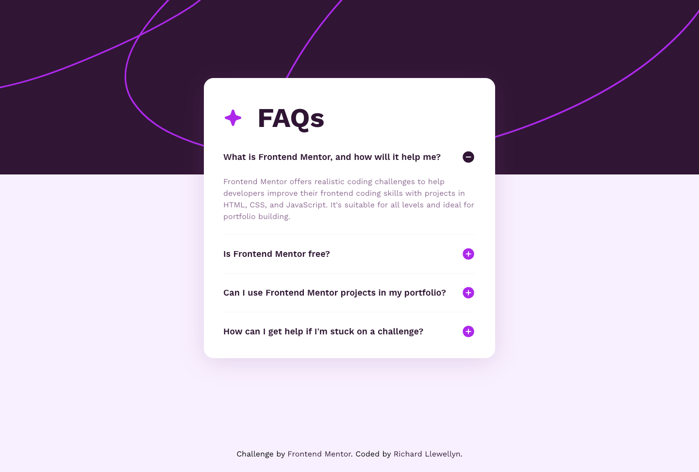

# Frontend Mentor - FAQ accordion solution

This is a solution to the [FAQ accordion challenge on Frontend Mentor](https://www.frontendmentor.io/challenges/faq-accordion-wyfFdeBwBz). Frontend Mentor challenges help you improve your coding skills by building realistic projects. 

## Table of contents

- [Overview](#overview)
  - [The challenge](#the-challenge)
  - [Screenshot](#screenshot)
  - [Links](#links)
- [My process](#my-process)
  - [Built with](#built-with)
  - [What I learned](#what-i-learned)
- [Author](#author)

## Overview

### The challenge

Users should be able to:

- Hide/Show the answer to a question when the question is clicked
- Navigate the questions and hide/show answers using keyboard navigation alone
- View the optimal layout for the interface depending on their device's screen size
- See hover and focus states for all interactive elements on the page

### Screenshot

### Links

- Solution URL: [https://www.frontendmentor.io/solutions/mobile-first-faq-accordion-with-javascript-and-flexbox-lcFh8MixNE](https://www.frontendmentor.io/solutions/mobile-first-faq-accordion-with-javascript-and-flexbox-lcFh8MixNE)
- Live Site URL: [https://richllew182.github.io/faq-accordion-main/](https://richllew182.github.io/faq-accordion-main/)

## My process

### Built with

- Semantic HTML5 markup
- CSS custom properties
- Flexbox
- Javscript

### What I learned

I learned to create my own interactive elements with html and javascript, rather then relying on existing components and libraries such as bootstrap, which would have made the solution much quicker, but I would not have learned as much along the way.

## Author

- Website - [Richard Llewellyn - Front End Developer Portfolio](https://richllew.dev/)
- Frontend Mentor - [@RichLlew182](https://www.frontendmentor.io/profile/RichLlew182)
